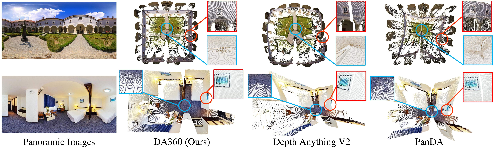

# Depth Anything in 360°: Towards Scale Invariance in the Wild


The Official Pytorch Implementation for

> [**Depth Anything in 360&deg: Towards Scale Invariance in the Wild**](https://insta360-research-team.github.io/DA360/)
>
> Authors: Hualie Jiang, Ziyang Song, Zhiqiang Lou, Rui Xu, Minglang Tan

<p align="center">

</p>


# Preparation

### Installation

Create the environment

```bash
conda env create -f environment.yaml
conda activate da360
pip install -r requirements.txt
```


# Evaluation

### Download the pre-trained models
```
bash scripts/download_models.sh
```

The pretrained models are available on [Google Drive](https://drive.google.com/drive/folders/1FMLWZfJ_IPKOa_cEbVqrq8_BRkl3oB_2?usp=drive_link) and can be downloaded mamanually. 


### Test On Panoramic Images  

Put the panoramic images in *./data/images* first then run the following command. There are six examples already. 
```
python test.py  --model_path ./checkpoints/DA360_large.pth --model_name DA360_large
```
The results would lie in *./checkpoints/DA360_large/results/*. 

### Perfom Evaluation
```
bash scripts/evaluate.sh
```


## Acknowledgements

The project is paritally based on [Depth Anything V2](https://github.com/DepthAnything/Depth-Anything-V2), [PanDA](https://github.com/caozidong/PanDA) and [UniFuse](https://github.com/alibaba/UniFuse-Unidirectional-Fusion).
 

## Citation

Please cite our paper if you find our work useful in your research.

```
@article{jiang2025depth,
  title={Depth Anything in $360\^{}$\backslash$circ $: Towards Scale Invariance in the Wild},
  author={Jiang, Hualie and Song, Ziyang and Lou, Zhiqiang and Xu, Rui and Tan, Minglang},
  journal={arXiv preprint arXiv:2512.22819},
  year={2025}
}
```
